# khaled: CABE Key Server Reference Implementation

<p align="center"></p>

`khaled` is a reference implementation of a **CABE Key Server**.

It implements the **CABE Key Access Protocol (CKAP)**: the protocol used by CABE clients to request, resolve, or use key material associated with a CABE Attribute Set.

In practical terms, `khaled` answers the question:

> Is this caller allowed to operate on this attribute-bound data, and if so, what cryptographic material or server-side operation should be made available?

`khaled` is not a general-purpose encryption service. It is the policy-controlled key authority that sits behind CABE envelope encryption.

---

## Table of Contents

- [Role in the CABE Architecture](#role-in-the-cabe-architecture)
- [What khaled Does](#what-khaled-does)
- [Repository Overview](#repository-overview)
- [Core Runtime Model](#core-runtime-model)
- [Core Concepts](#core-concepts)
- [CKAP Operations](#ckap-operations)
- [Execution Flows](#execution-flows)
- [Failure Paths](#failure-paths)
- [Configuration and Reload](#configuration-and-reload)
- [Plugin Architecture](#plugin-architecture)
- [Storage Model](#storage-model)
- [Security Model Summary](#security-model-summary)
- [Testing](#testing)
- [Contributing](#contributing)
- [Further Reading](#further-reading)

## Role in the CABE Architecture

CABE separates data protection from application logic by binding cryptographic access to attributes and policy.

A CABE client may need to:

- encrypt data under a CABE Attribute Set
- decrypt data protected under a CABE Attribute Set
- resolve a previous lease reference
- use a key without receiving the key directly

`khaled` provides the server-side CKAP functions needed for those flows.

At a high level:

```text
client identity → claims → policy decision → key derivation → CKAP response
```

---

## What khaled Does

`khaled` is responsible for:

- authenticating clients
- mapping authenticated identity into policy claims
- evaluating policy for CKAP operations
- deriving lease keys deterministically
- issuing authenticated lease references
- supporting captive-key operation where raw key material does not leave the server

Depending on policy and request mode, `khaled` can return either:

- a **non-captive lease**, where the client receives usable lease key material; or
- a **captive lease key access token**, where the server performs assisted operations without exposing the lease key to the client.

---

## What khaled Does Not Do

`khaled` does not replace the CABE client library.

It does not define the full CABE data format, nor does it perform all envelope construction work on behalf of applications. Instead, it provides the CKAP key access service used by CABE-aware clients.

For the broader CABE specification, see:

- CABE specification: https://cabespec.org/
- CABE architecture specification: https://cabespec.org/spec/arch/
- CKAP specification: https://cabespec.org/spec/ckap/

---

## Repository Overview

```text
cmd/khaled/         CLI entrypoint
pkg/server/         daemon construction, lifecycle, and reload loop
pkg/subsystems/     lifecycle-managed subsystem managers
pkg/plugin/         plugin interfaces and in-tree plugin registration
pkg/keyserver/      CKAP operation orchestration
pkg/keyschedule/    root, set, and lease key derivation
pkg/refwrapper/     lease reference and access-token wrapping
pkg/keywrap/        key wrapping support
pkg/httpmw/         HTTP middleware for auth, claims, and logging
pkg/config/         configuration objects and schema support
pkg/x509source/     X.509 and SPIFFE certificate source support
test/inproc/        in-process conformance and integration tests
test/kutest/        Kubernetes-oriented integration tests
doc/site/           documentation site
```

---

## Core Runtime Model

A normal request passes through four major layers:

```text
transport → authentication → claims mapping → key server
```

The key server then coordinates policy evaluation, key derivation, and response generation.

```text
authenticated client
        ↓
identity-to-claims mapping
        ↓
policy decision
        ↓
key derivation or assisted operation
        ↓
CKAP response
```

The design intentionally keeps transport, identity, policy, storage, and key derivation separate so each layer can evolve independently.

---

## Core Concepts

### Client Identity

A request begins with client authentication.

Current authentication mechanisms include:

- anonymous identity for testing or controlled deployments
- TLS client certificate authentication
- SPIFFE-based client authentication

The result of authentication is a client identity, typically represented as a URI.

---

### Claims Mapping

Authentication establishes who the caller is.

Claims mapping determines how that identity should be represented to policy.

For example, a SPIFFE ID or certificate identity can be mapped into claims such as:

```text
country = "US"
organization = "example"
role = "producer"
namespace = "mission-a"
```

The result is a policy principal.

```text
client identity → principal + claims
```

---

### Policy Evaluation

Every key operation is policy controlled.

Policy decides whether a principal may perform an operation against a CABE Attribute Set.

Typical policy questions include:

```text
Can this principal encapsulate for this attribute set?
Can this principal decapsulate for this attribute set?
Can this assisted operation proceed now?
```

`khaled` currently includes a Cedar policy engine plugin.

---

### Deterministic Key Derivation

`khaled` does not persist lease keys for every request.

Instead, it derives lease keys from persistent root key material, attribute-set representation, subepoch state, and lease time.

Conceptually:

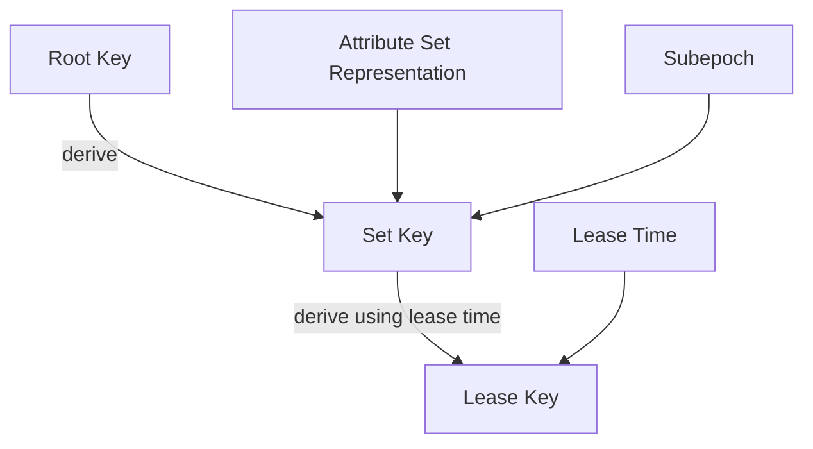

This allows `khaled` to resolve previously issued lease references without storing each lease key individually.

---

### Root Keys, Set Keys, and Lease Keys

The key hierarchy is:

```text
Root Key
  → Set Key
    → Lease Key
```

- **Root keys** are persisted and versioned.
- **Set keys** are derived for a given CABE Attribute Set and subepoch.
- **Lease keys** are derived for a specific lease time.

Root keys are retained after rotation so that older lease references can still be resolved when policy allows.

---

### Subepochs

Subepochs provide a scoped invalidation mechanism.

A subepoch is associated with a particular attribute set. Advancing the subepoch changes future derived keys for that attribute set without rotating the entire root key.

This makes it possible to invalidate or advance a specific attribute set independently from the whole domain.

---

### Lease References

A lease reference is an authenticated handle that lets a client later resolve a lease.

A lease reference contains enough authenticated metadata for `khaled` to rederive the relevant lease key, including information such as:

- root key sequence
- lease time
- subepoch

The reference is not itself raw key material.

---

### Captive and Non-Captive Modes

`khaled` supports two operating modes.

| Mode | Description |
| --- | --- |
| Non-captive | The client receives lease key material and performs the cryptographic operation locally. |
| Captive | The client receives a lease key access token and asks the server to perform assisted encapsulation or decapsulation. |

Captive mode is useful when deployment policy requires that lease keys remain within the server boundary.

---

## CKAP Operations

The main CKAP operations exposed by `khaled` are:

```text
GetSelf
Prograde
Retrograde
AssistedEncapsulate
AssistedDecapsulate
```

The HTTP transport currently exposes these under:

```text
POST /ckap/GetSelf
POST /ckap/Prograde
POST /ckap/Retrograde
POST /ckap/AssistedEncapsulate
POST /ckap/AssistedDecapsulate
```

The primary wire format is CBOR.

---

## Execution Flows

### Prograde

`Prograde` is used when a client wants a lease for encapsulation under a CABE Attribute Set.

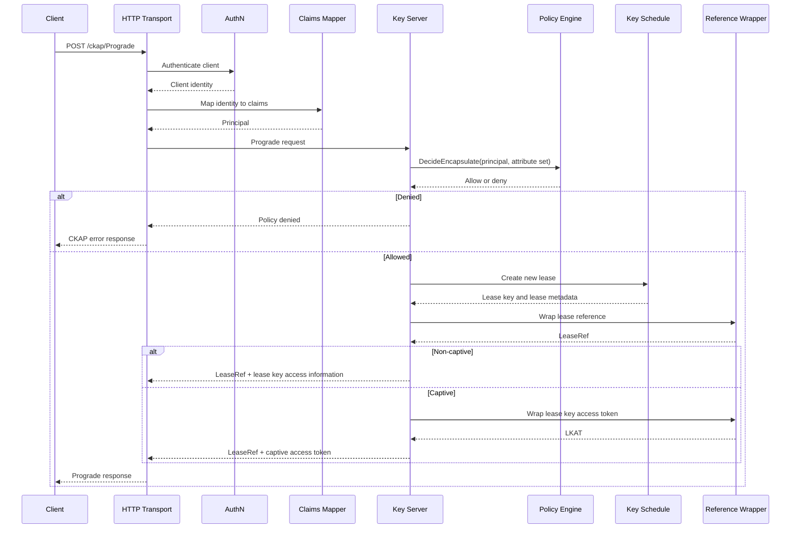

---

### Retrograde

`Retrograde` is used when a client wants to resolve a previously issued lease reference.

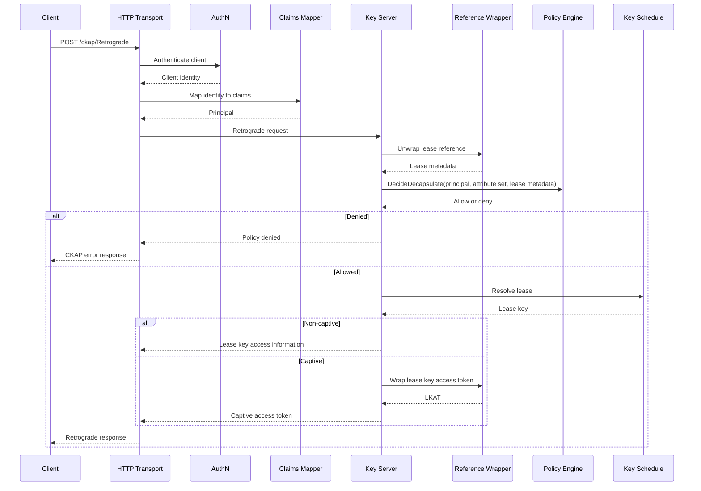

---

### Assisted Encapsulation

`AssistedEncapsulate` is used in captive mode. The client provides a lease key access token and a content encryption key, and the server returns a wrapped CEK.

The lease key does not leave the server.

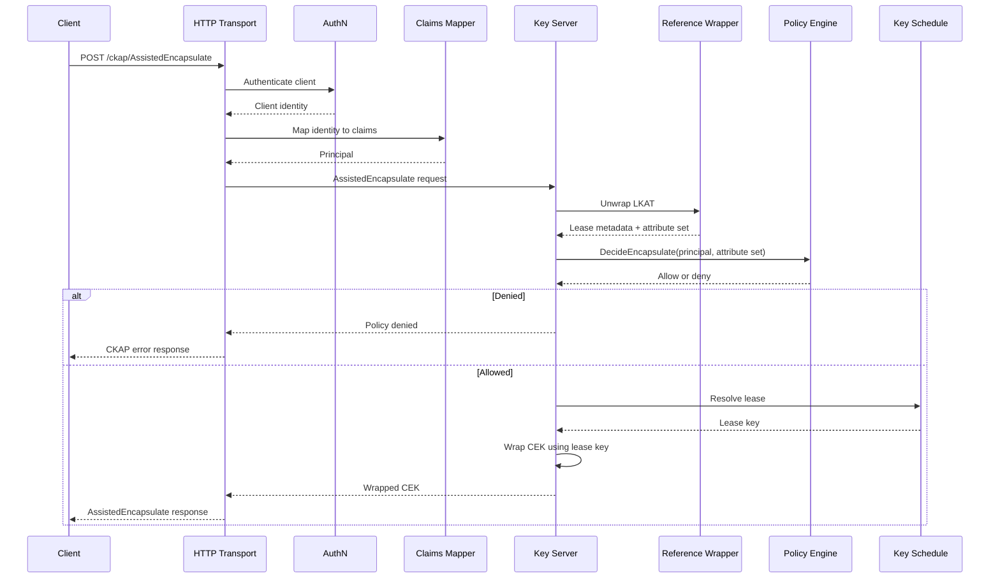

---

### Assisted Decapsulation

`AssistedDecapsulate` is also used in captive mode. The client provides a lease key access token and wrapped CEK, and the server returns the unwrapped CEK if policy allows.

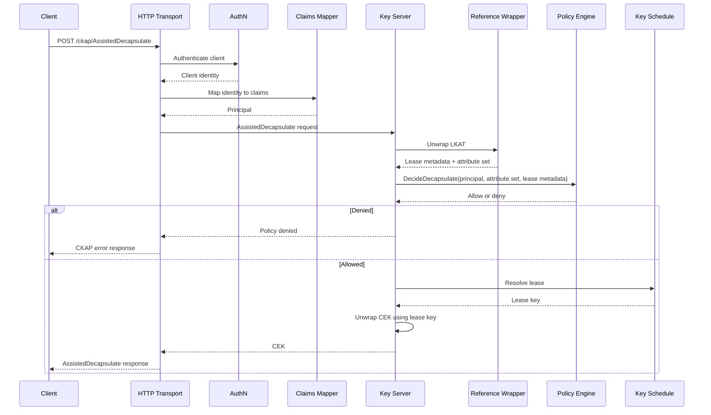

---

## Failure Paths

### Authentication Failure

If authentication fails, the request is rejected before claims mapping, policy evaluation, or key derivation.

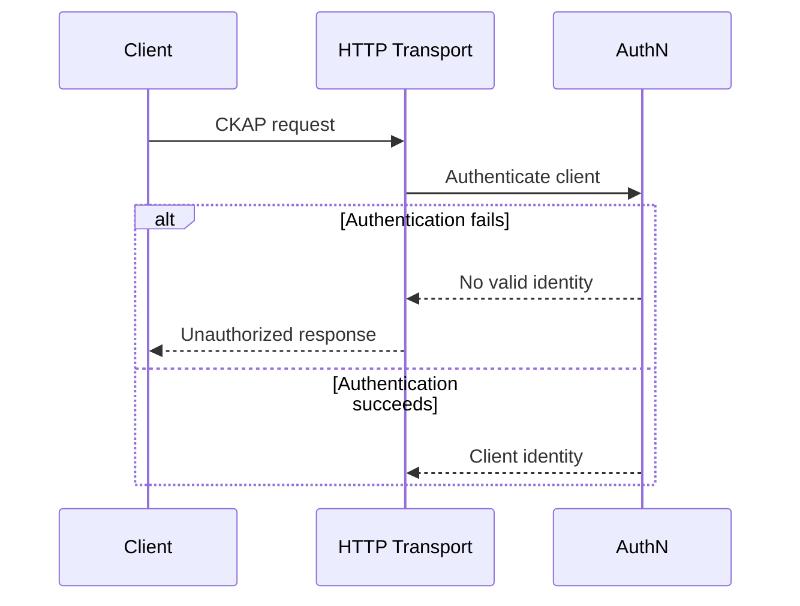

---

### Claims Mapping Failure

If the authenticated identity cannot be mapped into a usable principal, the request does not proceed to policy evaluation.

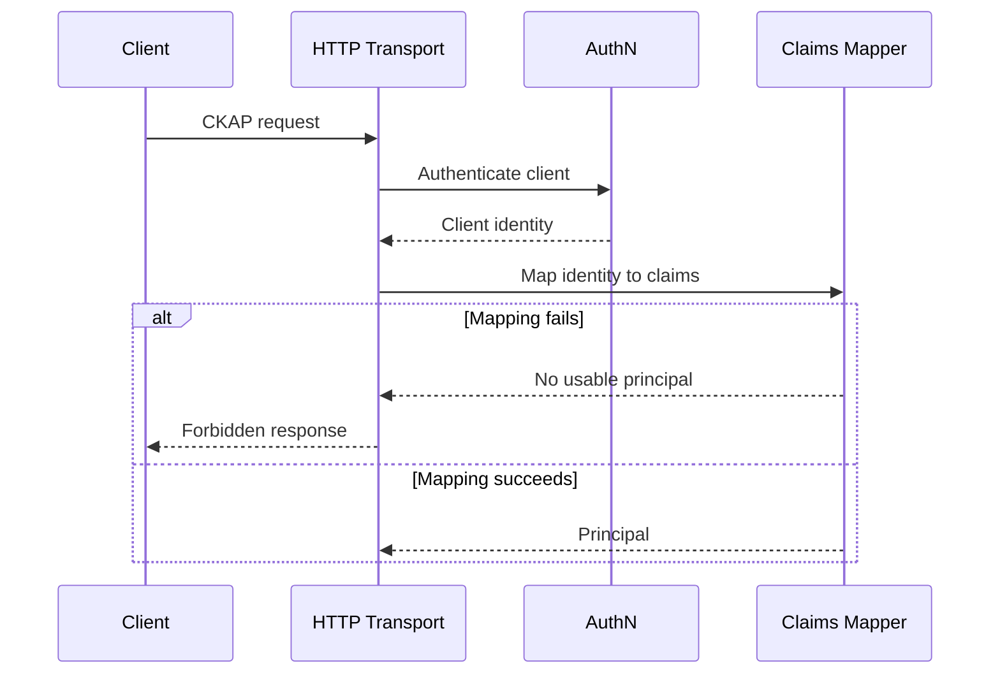

---

### Policy Denial

Policy denial is a normal outcome. No lease key is returned to the caller.

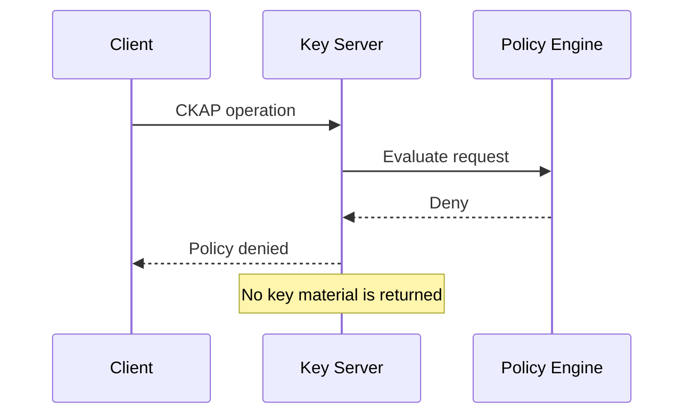

---

### Invalid Lease Reference

If a lease reference is malformed, tampered with, or cannot be authenticated, it is rejected before key derivation.

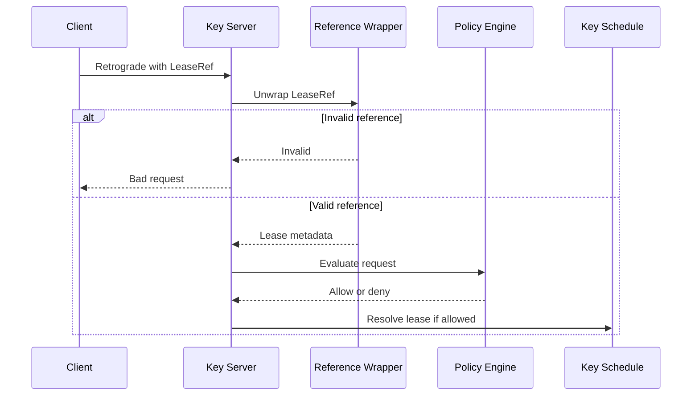

---

## Configuration and Reload

`khaled` is designed to support live configuration reload.

Configuration is provided by a config source plugin. When the configuration changes, each subsystem reconciles against the new snapshot.

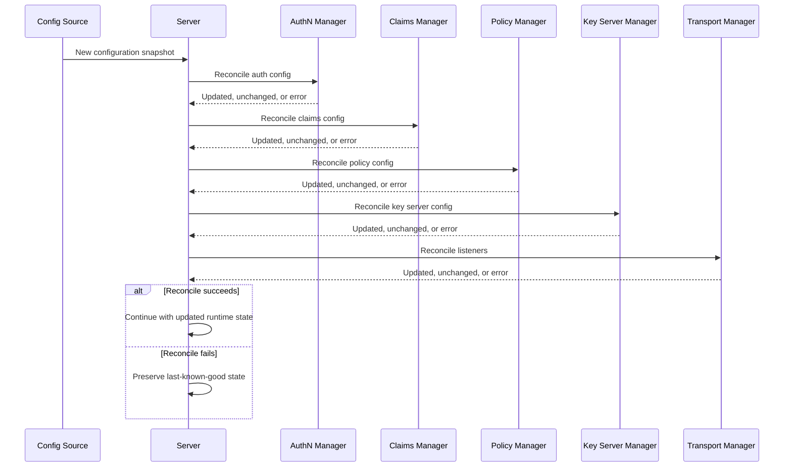

The important property is that a failed update should not destroy a previously working runtime state.

---

## Policy Reload

Policy can be reloaded independently.

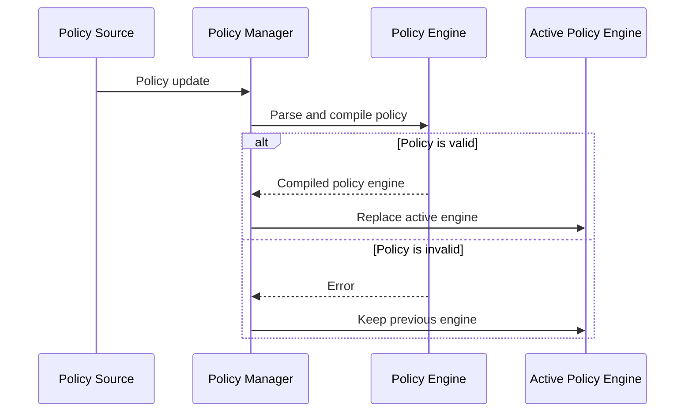

This allows policy updates to be applied without restarting the daemon.

---

## Startup Flow

At startup, `khaled` initializes subsystems in dependency order. Network listeners are started last.

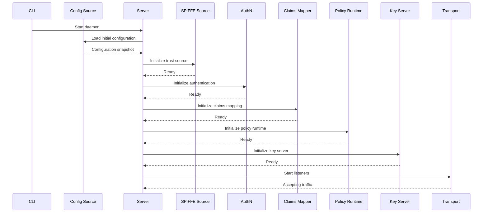

---

## Shutdown Flow

Shutdown happens in reverse order. `khaled` stops accepting traffic before tearing down internal subsystems.

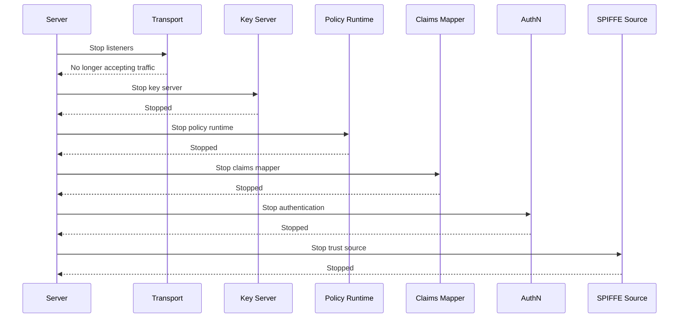

---

## Plugin Architecture

`khaled` is organized around plugins.

The main plugin categories are:

- config source
- key storage
- policy engine
- policy source
- client authentication
- claims mapping
- protocol transport

This allows different deployment environments to customize how `khaled` loads configuration, authenticates callers, evaluates policy, stores keys, and exposes CKAP.

---

## In-Tree Plugin Examples

The repository includes plugins for common deployment modes, including:

- disk-backed configuration
- Kubernetes-backed configuration
- disk-backed key storage
- Cedar policy evaluation
- file and inline policy sources
- anonymous authentication
- TLS client certificate authentication
- SPIFFE-based authentication
- static claims mapping
- Kubernetes-attestation claims mapping
- HTTP transport

The exact supported plugin set may evolve over time. The generated configuration schema is the source of truth for the current binary.

---

## Storage Model

Persistent storage is used for long-lived key server state, including:

- CABE domain metadata
- root keys
- root key sequence state
- subepoch state

Lease keys are not stored as individual database records. They are derived as needed from the key schedule.

The current disk key storage plugin uses SQLite.

---

## HTTP Transport

The HTTP transport exposes CKAP endpoints under `/ckap/`.

Primary endpoints:

```text
POST /ckap/GetSelf
POST /ckap/Prograde
POST /ckap/Retrograde
POST /ckap/AssistedEncapsulate
POST /ckap/AssistedDecapsulate
```

The transport expects CKAP requests and responses using the configured CKAP media type.

The implementation enforces request validation, method checks, body size limits, and CBOR decoding rules before handing requests to the key server.

---

## Security Model Summary

`khaled` is designed around a few security boundaries:

- clients must authenticate before accessing CKAP operations
- identity is mapped into claims before policy evaluation
- every key operation is authorized by policy
- lease references are authenticated handles, not raw keys
- lease keys are derived, not stored per request
- captive mode allows operation without exposing lease keys to clients
- root key rotation and subepoch advancement allow key schedule evolution over time

Deployment security depends on correct configuration of authentication, policy, key storage, and transport.

---

## Testing

The repository includes several classes of tests:

- package-level unit tests
- in-process conformance tests
- CKAP transport tests
- reload behavior tests
- Kubernetes-oriented integration tests

The Kubernetes tests are useful for validating behavior closer to realistic SPIFFE and cluster deployments.

---

## Contributing

This repository is intended to be understandable to new contributors without requiring them to reverse-engineer the entire codebase first.

A useful mental model for contributors is:

```text
authenticate → map claims → authorize → derive or resolve key material → respond
```

When changing the codebase, try to preserve the separation between:

- transport concerns
- identity and authentication
- claims mapping
- policy evaluation
- key derivation
- storage
- token/reference wrapping

That separation is what keeps the implementation testable and adaptable across deployment environments.

---

## Further Reading

- CABE specification: https://cabespec.org/
- CABE architecture specification: https://cabespec.org/spec/arch/
- CKAP specification: https://cabespec.org/spec/ckap/
- [Documentation site](/doc/site/)
- [Key schedule overview](/doc/site/src/content/docs/overview/key-schedule.mdx)
- [Configuration reference](/doc/site/src/content/docs/reference/config.mdx)
